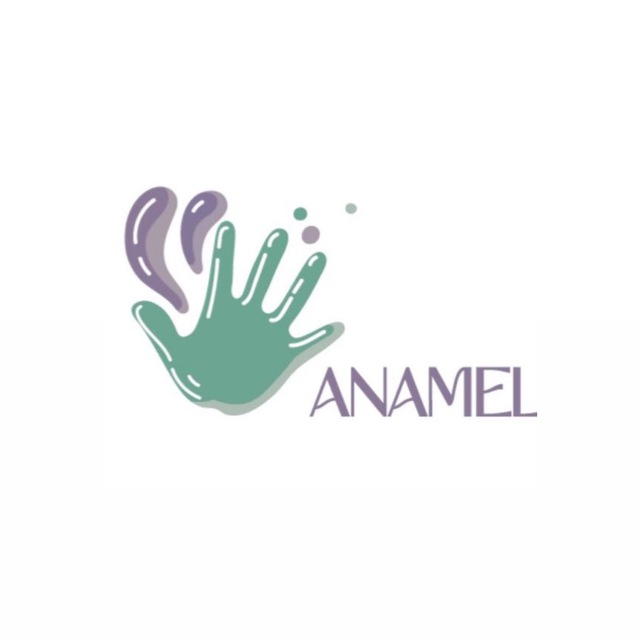

<p align="center">
  
</p>

<h1 align="center">
 ANAMEL: AI-Powered Children's Psychological and Mental Health Detection Through Drawing Analysis
</h1>

<p align="center">
  <a href="YOUR_PAPER_1_LINK">
    
  </a>
  <a href="YOUR_PAPER_2_LINK">
    
  </a>
  
  
</p>

## Overview

ANAMEL is a research-based AI application designed to assist in the early detection of psychological and mental health indicators in children through the analysis of their drawings.

The system combines Computer Vision, Deep Learning, and Mobile Technologies to provide an accessible platform for parents, specialists, and researchers. The project aims to support psychological assessment processes by analyzing children's drawings and generating preliminary insights based on trained AI models.

> **Note:** This repository is intended for research and portfolio purposes only. The source code, trained models, datasets, and proprietary implementation details are not publicly available.

---

## Project Objectives

* Analyze children's drawings using Artificial Intelligence.
* Assist in identifying potential psychological and emotional indicators.
* Provide a mobile platform for interaction and assessment.
* Support researchers and specialists with AI-powered analysis.
* Explore the application of Computer Vision in child psychology.

---

## System Architecture

The project integrates multiple technologies:

```text
Child Drawing
      │
      ▼
 Image Processing
      │
      ▼
 Deep Learning Model (YOLOv8-cls)
      │
      ▼
 Prediction Results
      │
      ▼
 Flutter Mobile Application
      │
      ▼
 Firebase Services
```

---

## Technologies & Tools

<p align="left">
  
</p>


---

## Research Publications

### Publication 1

**A Children's Psychological and Mental Health Detection Model by Drawing Analysis based on Computer Vision and Deep Learning**

Published in the *Engineering, Technology & Applied Science Research (ETASR)* Journal.

### Publication 2

**ANAMEL: Children's Psychological and Mental Health Detection Application by Drawing Analysis Based on AI**

Published in the *International Journal of Advanced Computer Science and Applications (IJACSA)*.

---

## Key Features

* AI-based drawing analysis.
* Mobile application interface.
* Child profile management.
* Automated prediction results.
* Research-oriented system design.
* Cloud-based backend integration.
* User-friendly workflow for assessment and monitoring.

---

## 🎥 Demonstration

Explore the project materials below:

- 📄 **Project Poster**  
  [View Poster](https://github.com/user-attachments/files/28528843/Project.poster.pdf)

- 🎬 **Video Demonstration**  
  [Watch Demo Video](https://heylink.me/AnamelAIApp/)
  
---

## Research Impact

This project explores the intersection of:

* Artificial Intelligence
* Child Psychology
* Computer Vision
* Mobile Healthcare Applications

The goal is to contribute to the development of intelligent tools that can support specialists in understanding children's emotional and psychological states through drawing analysis.

---

## Repository Contents

This repository contains:

* Project overview
* Research publications information
* System architecture
* Demo and documentation

This repository does **not** contain:

* Source code
* Training datasets
* Model weights
* Private implementation details

---

## Citation

If you use or reference this project in academic work, please cite the associated research publications.

---

## Authors

**Jenan Mustafa** and collaborators.

---

## Contact

For academic collaboration, research inquiries, or project discussions, please open an issue in this repository or contact the authors through their academic profiles.

---

## License

This repository is shared for academic and portfolio purposes only.

All rights reserved © ANAMEL Research Team.
